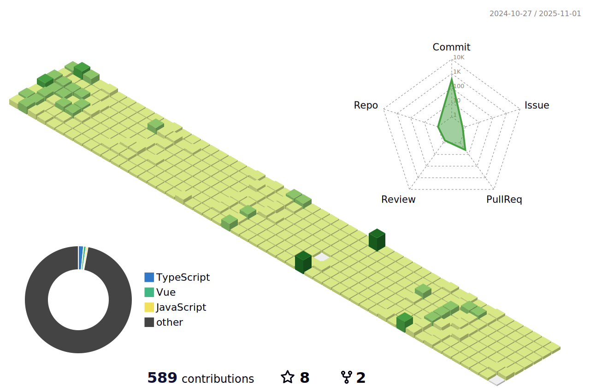
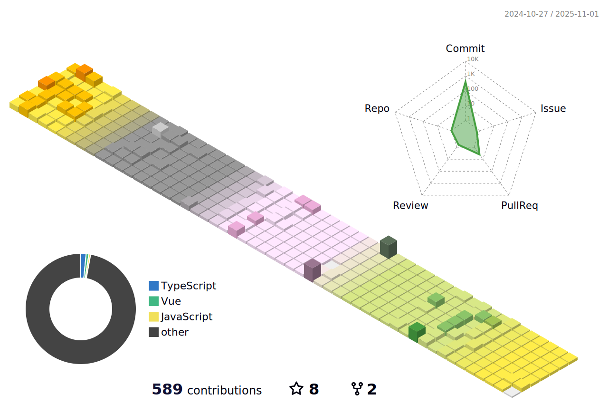
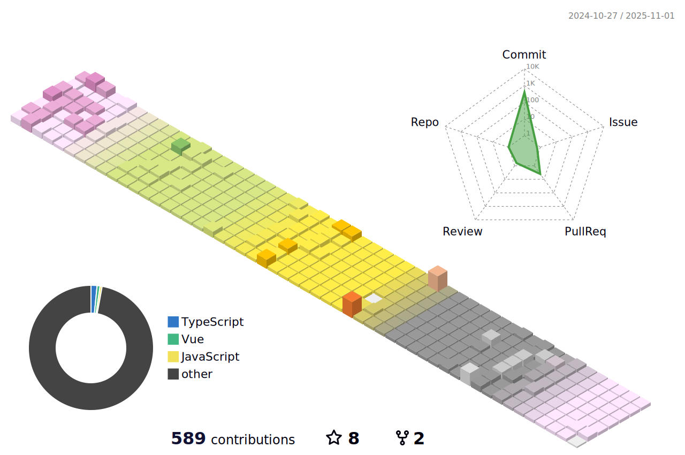
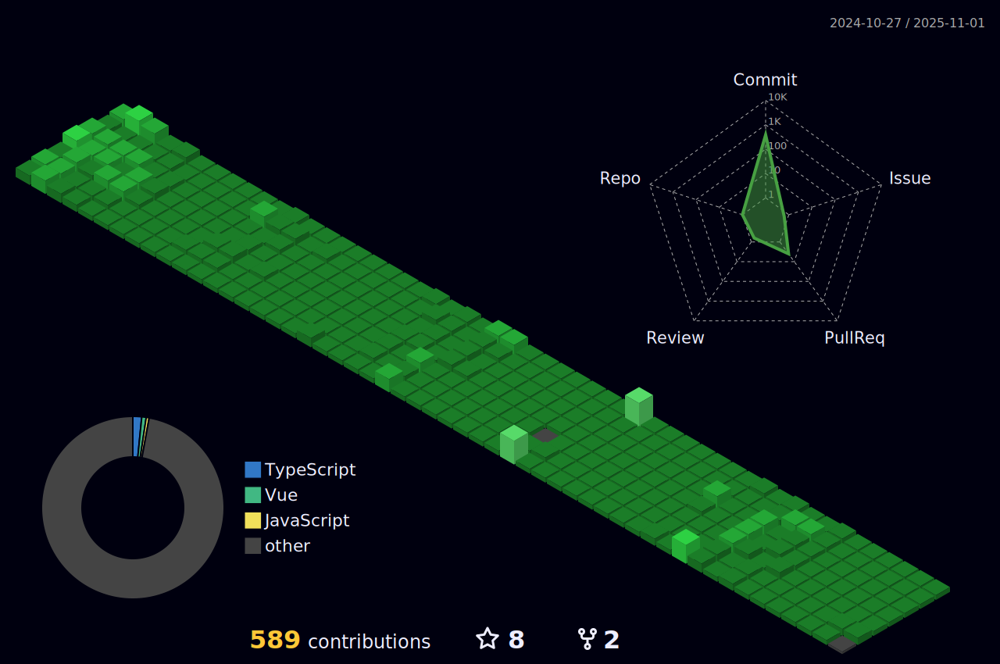
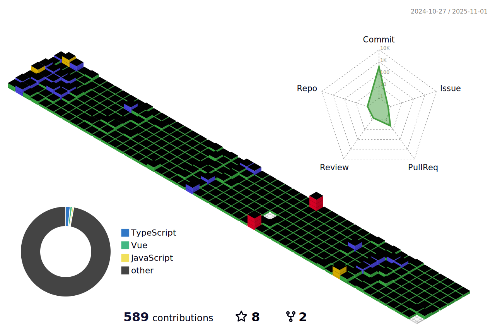

<!--
**wnsdnn/wnsdnn** is a ✨ _special_ ✨ repository because its `README.md` (this file) appears on your GitHub profile.

Here are some ideas to get you started:

- 🔭 I’m currently working on ...
- 🌱 I’m currently learning ...
- 👯 I’m looking to collaborate on ...
- 🤔 I’m looking for help with ...
- 💬 Ask me about ...
- 📫 How to reach me: ...
- 😄 Pronouns: ...
- ⚡ Fun fact: ...
-->

### 04년생 개발자 여준우입니다.

## 🖥 Introduce
 - Seoul Digitech High School (2020.03 ~ 2023.01)
 - Baewha Women's University [P-TECH] (2023.03 ~ 2025.02)
 - Tech University of Korea [P-TECH] (2025.03 ~ 현재)
 - eGemco (2022.09 ~ 현재)

 

<!--  -->

    

 

 

<!--  -->
<!--  -->
<!--  -->

<!--  -->
<!--  -->
<!--  -->
<!--  -->
<!--  -->
<!--  -->
<!--  -->
<!--  -->
<!--  -->
<!--  -->
<!--  -->

<!--  -->

<!--START_SECTION:waka-->
<!--END_SECTION:waka-->
